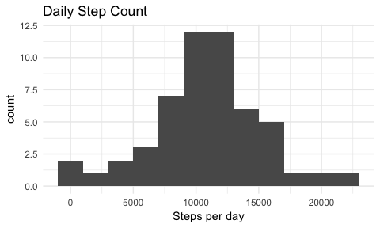
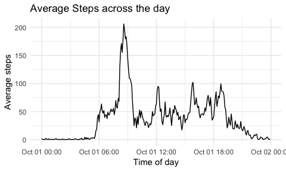
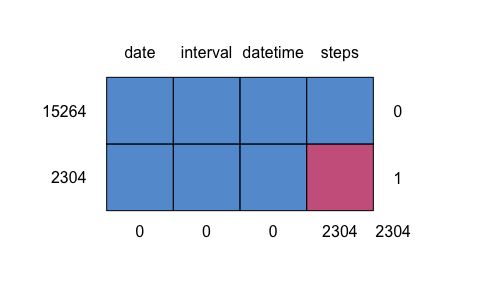
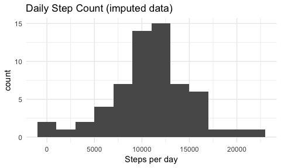

# Introduction

This analysis analyzes FitBit step tracking data to evaluate different activity patterns for the FitBit wearer on weekends and weekdays. 

The research question is, "Are there differences in steps between weekends and weekdays?"

The analysis will follow this outline:   
- Analyze the mean total number of steps taken per day.  
- Analyze the average daily activity pattern.   
- Analyze different activity patterns between weekdays and weekends.   

But first, let us setup the data


## Loading and preprocessing the data

First, I set a common size for figures. 

```r
knitr::opts_chunk$set(fig.width=5, fig.height=3) 
```

Second, I make library calls. 

```
## ── Attaching packages ──────────────────────────────────────────────────────── tidyverse 1.2.1 ──
```

```
## ✔ ggplot2 3.1.0     ✔ purrr   0.2.5
## ✔ tibble  1.4.2     ✔ dplyr   0.7.7
## ✔ tidyr   0.8.2     ✔ stringr 1.3.1
## ✔ readr   1.1.1     ✔ forcats 0.3.0
```

```
## ── Conflicts ─────────────────────────────────────────────────────────── tidyverse_conflicts() ──
## ✖ dplyr::filter() masks stats::filter()
## ✖ dplyr::lag()    masks stats::lag()
```

```
## 
## Attaching package: 'lubridate'
```

```
## The following object is masked from 'package:base':
## 
##     date
```

```
## Loading required package: lattice
```

```
## 
## Attaching package: 'mice'
```

```
## The following object is masked from 'package:tidyr':
## 
##     complete
```

```
## The following objects are masked from 'package:base':
## 
##     cbind, rbind
```

Third, I unzip and import the dataset. 

```r
#Unzip file, if not already unzipped 
filePath <- "./activity.zip"

if(!file.exists("./activity.csv")){
  local_file <- unzip("./activity.zip", exdir="./", unzip = "internal")
  path <- (local_file)
} else {
  message("File already downloaded")
  local_file <- "./activity.csv"
}
```

```
## File already downloaded
```

```r
#Import CSV
fitbit <- readr::read_csv(local_file, col_types = "iDi" )
```

The structure of the imported data set is: 

```r
str(fitbit)
```

```
## Classes 'tbl_df', 'tbl' and 'data.frame':	17568 obs. of  3 variables:
##  $ steps   : int  NA NA NA NA NA NA NA NA NA NA ...
##  $ date    : Date, format: "2012-10-01" "2012-10-01" ...
##  $ interval: int  0 5 10 15 20 25 30 35 40 45 ...
##  - attr(*, "spec")=List of 2
##   ..$ cols   :List of 3
##   .. ..$ steps   : list()
##   .. .. ..- attr(*, "class")= chr  "collector_integer" "collector"
##   .. ..$ date    :List of 1
##   .. .. ..$ format: chr ""
##   .. .. ..- attr(*, "class")= chr  "collector_date" "collector"
##   .. ..$ interval: list()
##   .. .. ..- attr(*, "class")= chr  "collector_integer" "collector"
##   ..$ default: list()
##   .. ..- attr(*, "class")= chr  "collector_guess" "collector"
##   ..- attr(*, "class")= chr "col_spec"
```

This data is unusable for dates and times in timeseries operators. Interval is 0 = 00:00 to 00:05, 5 = 00:06 - 00:10, 10 = 00:11 - 00:15... 
55 = 00:55-01:00, 100 = 01:01 - 01:05. I will generate a datetime using the start of the interval as the datetime. 


```r
#the paste0 turns this into a string to feed into ymd_hm
#formatC is the same as printF and turns 0 into 0000 and 2355 into 2355
fitbit <- fitbit %>% 
  mutate(datetime = ymd_hm(paste0(as.character.Date(date),formatC(interval, width = 4, format = "d", flag = "0"))))
```


```r
observations <- dim(fitbit)[1]
```

There are 17568 observations in the dataset. 

The dataset has four variables,  
- *steps*: Number of steps taking in a 5-minute interval (missing values are coded as NA)  
- *date*: The date on which the measurement was taken in YYYY-MM-DD format  
- *interval*: Identifier for the 5-minute interval in which measurement was taken  
- *datetime*: The date and time of the END of the 5-minute interval for meaasuring steps. 


## What is mean total number of steps taken per day?

First, I calculate the total number of steps taken ove each day 


```r
daysteps <- fitbit %>% 
  group_by(date(datetime)) %>% 
  summarize(sumSteps = sum(steps))
```

Next, I plot a histogram of the frequency of total steps per day. 

```r
ggplot(data = daysteps, aes(x = sumSteps))+
      geom_histogram(binwidth = 2000) +
      labs(title = "Daily Step Count", x = "Steps per day") +
      theme_minimal()
```

```
## Warning: Removed 8 rows containing non-finite values (stat_bin).
```

<!-- -->

```r
meanSteps <-  mean(daysteps$sumSteps, na.rm = TRUE)
medianSteps <- median(daysteps$sumSteps, na.rm = TRUE)
```

**Results** The median number of daily steps is 10765 and the mean number of steps is 1.0766189\times 10^{4}.


## What is the average daily activity pattern?

I will calculate the average daily step count and summarize the results in a time series plot.

The analytic trick to being able to aggregate across all days AND to get the resulting
charts to print with nice descriptive labels, is to change all of the dates to have
the same date and month using the update function. See  <https://stackoverflow.com/questions/9839343/extracting-time-from-posixct> for more details.


```r
timesteps <- fitbit %>% 
      #The update function allows me to set the days all the same
      mutate(datetime = update(datetime, month = 10, day = 1)) %>% 
      group_by(datetime) %>% 
      summarize(avgSteps = mean(steps, na.rm = TRUE))
```

Next, I create a line plot for the average steps in each 5-minute interval of the day. 


```r
ggplot(data = timesteps) +
  geom_line(aes(x = datetime, y = avgSteps)) +
  labs(title = "Average Steps across the day",
       x = "Time of day", 
       y = "Average steps") +
      theme_minimal()
```

<!-- -->

### 2. Which 5-minute interval, on average across all the days in the dataset, contains the maximum number of steps?

I create a table of the 10 time intervals with the most steps. 


```r
timesteps <- timesteps %>% arrange(desc(avgSteps)) %>% mutate(datetime = as.character.Date(datetime))
print(xtable(timesteps[1:10,]), type = "html")
```

<!-- html table generated in R 3.5.0 by xtable 1.8-3 package -->
<!-- Tue Dec 25 15:24:33 2018 -->
<table border=1>
<tr> <th>  </th> <th> datetime </th> <th> avgSteps </th>  </tr>
  <tr> <td align="right"> 1 </td> <td> 2012-10-01 08:35:00 </td> <td align="right"> 206.17 </td> </tr>
  <tr> <td align="right"> 2 </td> <td> 2012-10-01 08:40:00 </td> <td align="right"> 195.92 </td> </tr>
  <tr> <td align="right"> 3 </td> <td> 2012-10-01 08:50:00 </td> <td align="right"> 183.40 </td> </tr>
  <tr> <td align="right"> 4 </td> <td> 2012-10-01 08:45:00 </td> <td align="right"> 179.57 </td> </tr>
  <tr> <td align="right"> 5 </td> <td> 2012-10-01 08:30:00 </td> <td align="right"> 177.30 </td> </tr>
  <tr> <td align="right"> 6 </td> <td> 2012-10-01 08:20:00 </td> <td align="right"> 171.15 </td> </tr>
  <tr> <td align="right"> 7 </td> <td> 2012-10-01 08:55:00 </td> <td align="right"> 167.02 </td> </tr>
  <tr> <td align="right"> 8 </td> <td> 2012-10-01 08:15:00 </td> <td align="right"> 157.53 </td> </tr>
  <tr> <td align="right"> 9 </td> <td> 2012-10-01 08:25:00 </td> <td align="right"> 155.40 </td> </tr>
  <tr> <td align="right"> 10 </td> <td> 2012-10-01 09:00:00 </td> <td align="right"> 143.45 </td> </tr>
   </table>

**Results**: From the table above, we can see that the top times of the day for total steps per 5-minute interval 
are between 8:15 and 8:55am. The peak time is 2012-10-01 08:35:00 where 206.1698113 steps were taken. 


## Imputing missing values

### 1. Calculate and report the total number of missing values in the dataset (i.e. the total number of rows with NAs)

```r
summary(fitbit)
```

```
##      steps             date               interval     
##  Min.   :  0.00   Min.   :2012-10-01   Min.   :   0.0  
##  1st Qu.:  0.00   1st Qu.:2012-10-16   1st Qu.: 588.8  
##  Median :  0.00   Median :2012-10-31   Median :1177.5  
##  Mean   : 37.38   Mean   :2012-10-31   Mean   :1177.5  
##  3rd Qu.: 12.00   3rd Qu.:2012-11-15   3rd Qu.:1766.2  
##  Max.   :806.00   Max.   :2012-11-30   Max.   :2355.0  
##  NA's   :2304                                          
##     datetime                  
##  Min.   :2012-10-01 00:00:00  
##  1st Qu.:2012-10-16 05:58:45  
##  Median :2012-10-31 11:57:30  
##  Mean   :2012-10-31 11:57:30  
##  3rd Qu.:2012-11-15 17:56:15  
##  Max.   :2012-11-30 23:55:00  
## 
```

**Results** This table shows that there are no missing dates or intervals, but there are 2304 observations for steps that are missing. 

Next, I load the MICE package (Multiple Imputation for Chained Equations) and visually
identify the patterns of missing variables in the data. 


```r
require(mice)
md.pattern(fitbit)
```

<!-- -->

```
##       date interval datetime steps     
## 15264    1        1        1     1    0
## 2304     1        1        1     0    1
##          0        0        0  2304 2304
```


**Results** The blue and red squares are showing patterns of missing variables. Red means there are missing variables (0 = not missing, 1 = missing). So again, this confirms visually there are 2304 observations missing for steps variable.


### 2. My strategy for filling in all of the missing values in the dataset. 

I have enough observations in order to use advanced statistical modeling for multiple imputation using a predictive mean matching algorithm available in the MICE package. 

*I don't have a PhD in outcomes research to NOT use sophisticated statistics for imputation. I mean, this is what I do... *


### 3. Create a new dataset that is equal to the original dataset but with the missing data filled in.

The MICE package has the ability to conduct mulitple imputation and complex analyses of imputed datasets. However, for this, I will just pick one of the imputed iterations to use as the new dataset. Typically, I would use the multiple imputed datasets to conduct the same statistical model, then pool the results. That is definitely too complicated for this data.

mice() parameters:  
- m  – Refers to 5 imputed data sets  
- maxit – Refers to no. of iterations taken to impute missing values  
- method – Refers to method used in imputation. we used predictive mean matching.  


```r
#impute missing step values using predictive mean matching
imputation <- mice(fitbit, m=5, maxit = 50, method = 'pmm', seed = 500, printFlag = FALSE)
```

```
## Warning: Number of logged events: 1
```

```r
#set the valuse from set 5 as the new values for steps in the imputed dataset
imp_fitbit <- complete(imputation, 5)
```

I now have an imputed dataset with no missing values. imp_fitbit

### 4a. Make a histogram of the total number of steps taken each day 

I will recalculate the total daily steps, using the imputed data. 


```r
imp_fitbit_steps <- imp_fitbit %>% 
  group_by(date(datetime)) %>% 
  summarize(sumSteps = sum(steps))
```

And then plot a histogram of the imputed data. 


```r
ggplot(data = imp_fitbit_steps, aes(x = sumSteps))+
      geom_histogram(binwidth = 2000) +
      labs(title = "Daily Step Count (imputed data)", x = "Steps per day")  +
      theme_minimal()
```

<!-- -->


### 4b. Calculate and report the mean and median total number of steps taken per day. 

I will calculate the mean and median, using the method above, then compare the results in a simple table. 

```r
meanStepsI <-  mean(imp_fitbit_steps$sumSteps, na.rm = TRUE)
medianStepsI <- median(imp_fitbit_steps$sumSteps, na.rm = TRUE)
```

| Statistic | Before Imputation | After Imputation |
|:----------|:-----------------:|:----------------:|
| Mean  | 1.0766189\times 10^{4} | 1.0883967\times 10^{4} |
| Median | 10765 | 11015 | 


**Results:** The effect of imputing missing data on the estimates of the total daily number of steps is to raise the mean and median number of daily steps. Also, because the mean and median are both similar in these two datasets, the imputation did not change the skew or kurtosis of the data. 


## Are there differences in activity patterns between weekdays and weekends?

I will answer the primary research question by analyzing data for activity on weekends and weekdays. 

### 1. Create a new factor variable in the dataset with two levels – “weekday” and “weekend” indicating whether a given date is a weekday or weekend day.

Note that the wday() function in lubridate uses the lubridate.week.start global parameter to determine the mapping of days of the week "SUnday","Monday", etc to integers 1, 2, 3... So weekends are 1 (Sunday) and 7 (Saturday).


```r
imp_fitbit <- imp_fitbit %>% 
  mutate(weekend = case_when(
    wday(datetime) %in% c(1,7) ~ "Weekend", 
    wday(datetime) %in% c(2, 3, 4, 5, 6) ~ "Weekday" ))
```

Then check the coding of this new variable with a quick table of days of the week and the weekend flag. 


```r
table(wday(imp_fitbit$datetime, label = TRUE), imp_fitbit$weekend)
```

```
##      
##       Weekday Weekend
##   Sun       0    2304
##   Mon    2592       0
##   Tue    2592       0
##   Wed    2592       0
##   Thu    2592       0
##   Fri    2592       0
##   Sat       0    2304
```


### 2. Make a panel plot containing a time series plot (i.e. type="l") of the 5-minute interval (x-axis) and the average number of steps taken, averaged across all weekday days or weekend days (y-axis). 

The instructions were not explicit, but I am using the imputed dataset for these analyzes. 

First, I need to recalculate the average steps for each 5 minute interval for weekdays and weekends. 


```r
imp_fitbit_avgday <- imp_fitbit %>% 
      #According to https://stackoverflow.com/questions/9839343/extracting-time-from-posixct
      #The best way to calculate across days is to set the days all the same
      mutate(datetime = update(datetime, month = 10, day = 1)) %>% 
      group_by(weekend, datetime) %>% 
      summarize(avgSteps = mean(steps, na.rm = TRUE))
```

Next, I plot a 2-panel plot comparing steps per 5-minute interval for weekends and weekdays.


```r
ggplot(data = imp_fitbit_avgday, aes(x = datetime, y = avgSteps, col = weekend)) +
  geom_line(aes(x = datetime, y = avgSteps), show.legend = FALSE) +
  facet_grid(weekend~.) +
  labs(title = "Average Steps per 5 minutes across the day",
       subtitle = "Comparing Weekends versus Weekdays",
       x = "Time of day", 
       y = "Average steps")  +
      theme_minimal()
```

<!-- -->

**Results**: In summary, the pattern observed above shows there is a difference in steps per 5-minute increment between weekdays and weekends. Activity begins earlier on weekdays, around 6am, but on weekends begins later, closer to 7am. Activity discontinues earlier on weekdays, around 7pm, but on weekends, continues until 9pm. There is a weekday pattern of high step activity just before 9am that is not as strongly observed on weekends. 

